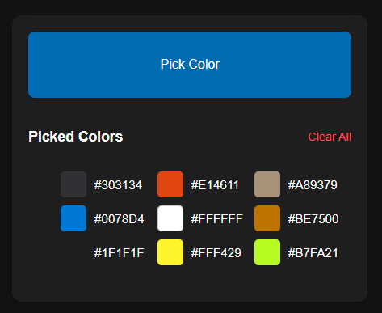
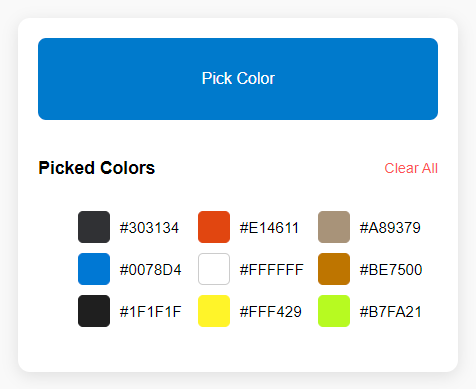
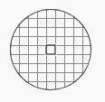

[]([https://chromewebstore.google.com/](https://chromewebstore.google.com/detail/color-picker/lefmceknabkjodbjeocajdfhnlelaedc?authuser=0)

# Color Picker Chrome Extension


**Color Picker** is a feature-rich Chrome extension designed to simplify the process of selecting and managing colors. Ideal for designers and developers, this tool offers customizable options to save, copy, and format colors according to your preferences.

## Key Features

- **Pick Colors from Anywhere**: Easily pick any color on your screen using the built-in EyeDropper tool.
- **Save Your Colors**: Store picked colors in a palette for future use.
- **Copy Color Codes**: Quickly copy color codes in either HEX or RGB format based on your preference.
- **Customizable Options**: Choose your preferred color format (HEX/RGB) and set your copy type from the options page.
- **Clear All Colors**: Easily clear all saved colors with one click.

## Getting Started

### Installation

#### Install from Chrome Web Store

You can easily install the extension directly from the [Chrome Web Store](https://chromewebstore.google.com/detail/color-picker/lefmceknabkjodbjeocajdfhnlelaedc?authuser=0).

#### Manual Installation Using Source Code

1. Clone the repository:
    ```bash
    git clone https://github.com/firatkaanbitmez/color-picker-extension.git
    ```
2. Navigate to `chrome://extensions/` in your browser.
3. Enable "Developer mode" by toggling the switch in the top right corner.
4. Click "Load unpacked" and select the folder where you cloned the repository.

## How to Use

1. **Pick a Color**: Click the "Pick Color" button in the popup to launch the EyeDropper tool. Select any color from your screen.
2. **View Saved Colors**: The picked colors are displayed in the popup, with their codes in the format you selected (HEX/RGB).
3. **Copy a Color Code**: Click on any saved color to copy its code to the clipboard in your preferred format (HEX/RGB).
4. **Clear All Colors**: Use the "Clear All" button to remove all saved colors.

## Configurable Options

You can customize your experience via the options page:
- **Default Color Format**: Choose between HEX and RGB formats.
- **Copy Type**: Set the format (HEX or RGB) used when copying color codes.

## Screenshots






## Development

To build and test the extension locally:

1. Clone the repository and navigate to the project directory.
2. Make your changes and test them by loading the unpacked extension in Chrome.

## Contributing

Contributions are welcome! Please fork the repository and submit a pull request with your improvements.

## License

This project is licensed under the MIT License. See the [LICENSE](./LICENSE) file for more details.

## Feedback and Support

For any inquiries or feedback, feel free to reach out via [email](mailto:firatbitmez.dev@gmail.com).
